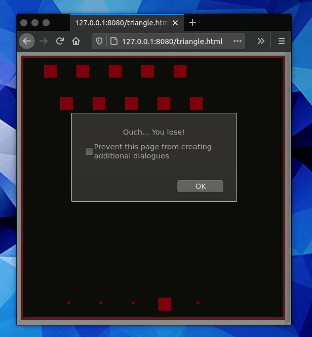

# Intro to Computer Graphics: Space Invaders Project

This assignment was completed during the SFU CMPT361 course found here:
https://www2.cs.sfu.ca/~kkyin/cmpt361/index.html

# Showcase

# Details

I implemented a simplified version of the game Space Invaders, implementing the 
following components: 

- The game window consists of a rectangle of appropriate size, 
e.g., so that the window will fit in the screen comfortably. 

- Red Aliens Movement: Drew two rows of red aliens at the top of the screen. 
They move left and right randomly, and move downward in uniform speed. If any alien reaches the
bottom of the screen, the aliens win and the game is over.

- Cannon Movement: Drew one cannon at the bottom of the screen. The cannon can be moved by
the left and right arrow keys on the keyboard.

- Red Aliens’s Shooting: The red aliens shoot bullets downward continuously in uniform speed. 
If any of the bullets touch the cannon, the cannon is destroyed and the aliens win. 
The aliens do not collide into each other, and the aliens do not shoot each other either. 
The top row aliens only start to shoot after all lower row aliens are killed.

- Shooting Cannonball: The cannon shoots cannonballs upward when the user clicks on the
spacebar. If any cannonball touches an alien, the alien dies and disappears. The aliens
lose if they are all killed by cannonballs before any of them reaches the bottom of
the screen.

- Faster Movement: The aliens move left and right faster and faster, when they get closer and closer to the bottom of the screen.

- Balanced Game Difficulty: Tuned the movement and shooting parameters so that the player does not win or lose all the time. She should win sometimes and lose sometimes.

- Additional Game Logic: Press ‘q’ to quit and ‘r’ to restart the game. Report in a pop-up window if the player win or lose at the end of the game.
